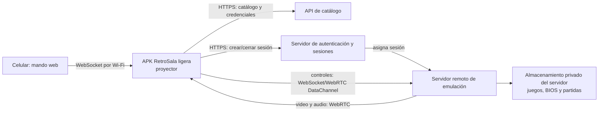

# Arquitectura de streaming remoto

## Responsabilidades

| Componente | Responsabilidad | No hace |
|---|---|---|
| APK del proyector | Interfaz, QR, reproducción audio/vídeo, envío de controles | Ejecutar emuladores o almacenar juegos/BIOS |
| Mando web | Botones y panel táctil de DS, envío de controles por Wi-Fi | Ejecutar juegos |
| API de catálogo | Juegos disponibles, idioma, plataforma, `gameId`, jugadores y servidor | Entregar archivos de juego al proyector |
| Sesiones/autenticación | Autoriza al usuario, crea sesiones y emite credenciales efímeras | Transmitir medios directamente |
| Emulación remota | Ejecuta emuladores, procesa controles y produce vídeo/audio | Exponer ROMs o BIOS al cliente |
| Almacenamiento remoto | Conserva juegos autorizados, BIOS y partidas | Ser público o estar versionado en Git |

## Flujo de una partida

1. La APK pide el catálogo y el usuario elige un `gameId`.
2. La APK solicita una sesión al servidor de sesiones.
3. El servidor elige una máquina de emulación compatible y arranca la sesión.
4. La APK recibe vídeo/audio y genera un QR para conectar celulares en la misma Wi-Fi.
5. El mando web transmite controles a la APK, que los reenvía a la sesión remota.
6. El servidor guarda la partida y termina la sesión cuando el usuario sale.

## Primera integración real

GBA y Nintendo DS: WebRTC para medios, señalización autenticada, un servicio de catálogo y un protocolo de controles que incluya superficie táctil para DS. PS1, PS2 y Xbox quedan para el servidor pagado posterior.
